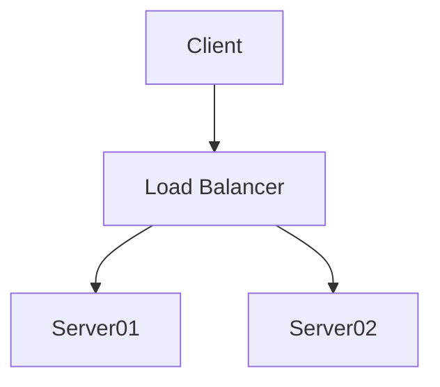

> A digital garden is an online space at the intersection of a notebook and a blog, where digital gardeners share seeds of thoughts to be cultivated in public. Contrary to a blog, where articles and essays have a publication date and start decaying as soon as they are published, a digital garden is evergreen: digital gardeners keep on editing and refining their notes.

You can use [[Gatsby Garden]] to create your own Digital Garden from your [[Zettelkasten]] notes.

Attaching image like normal  link: 

Attaching image like wikilink
![[testimg-cover.jpg]]

Further changes done with external link
[google](https://www.google.com)

Now internal link:
[[Permanent Notes]]

External image

Mermaid test
